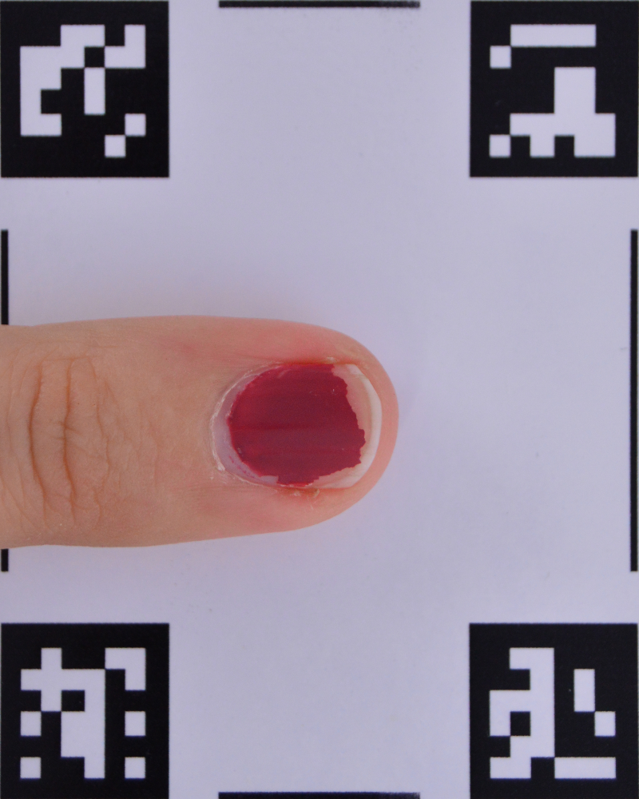
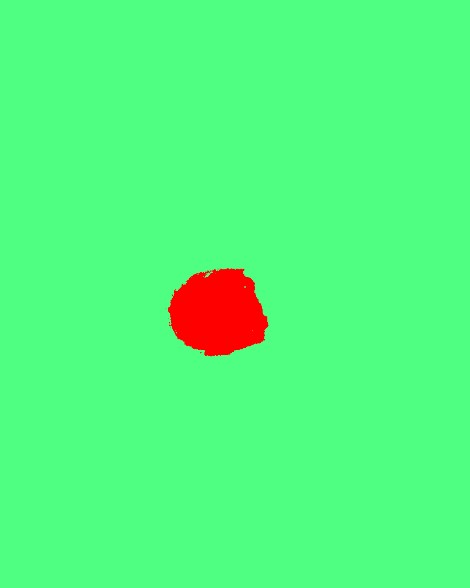

# NPMicroplastic
Nail Polish Microplastic **Project**

> Authors: Bruna Natalina de S. Martins, Mario A. de S. Liziér, Adriana de O. Delgado-Silva e Walter R. Waldman
> Affiliations: Federal University of São Carlos at Sorocaba - São Paulo - Brazil

## Contact

## Project description

### Obtaining images
The procedure for obtaining the samples consisted of painting the nails of the volunteers and monitoring them with photographs over 13 days to obtain a graph with information about the surface area of ​​the remaining nail polish. A team of nail salon professionals was hired to paint the nails of four categories of volunteers: students, teachers, administrative technicians, and outsourced cleaning staff.

### Main pipeline:

* [Pre-Processing](pre-processing/README.md)
* [Segmentation Step](segmentation/README.md)
* [Post-Processing](post-processing/README.md)

| Captured Image | Pre-Processing | Segmentation Step | Post-Processing |
| -------------- | -------------- | ----------------- | --------------- |
|  |  |  |  |

### Output Data

From then sample image stored at GitHub : [CSV Data](post-processing/data/data.csv)

## Dataset used

[Download](http://ufscar.br)
